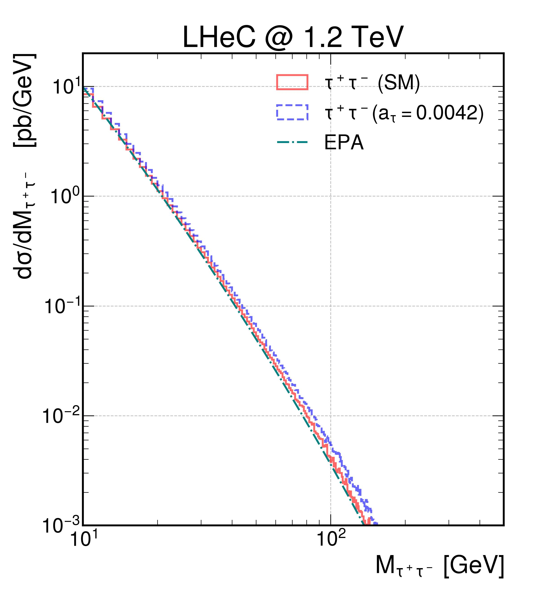
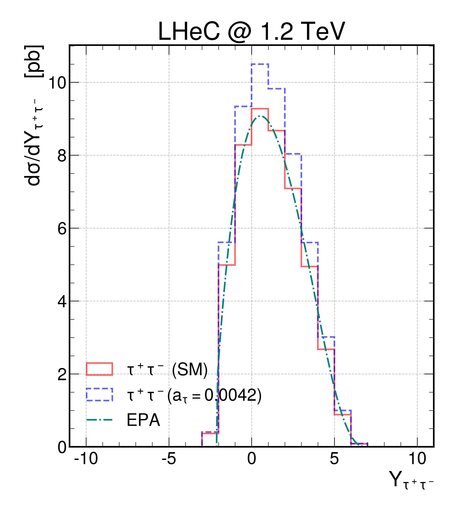
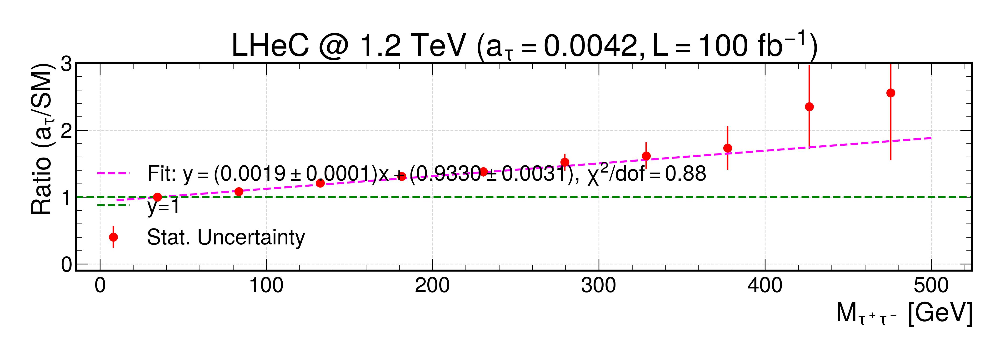

# Anomalous Electromagnetic Moments of the Tau Lepton

This repository contains a working analysis setup for studying the anomalous electromagnetic moments of the tau lepton in photon-induced tau-pair production, with a focus on kinematic distributions and SM vs BSM comparisons at the LHeC.

The codebase is best understood as a **research workspace** rather than a packaged software release. It includes:

- SMEFT-related inputs for connecting an anomalous tau magnetic moment to the Wilson coefficient `ceB`
- UFO model archives and a sample `param_card.dat`
- Python scripts for parsing LHE event files
- Plotting scripts for differential distributions and SM/BSM ratios
- EPA reference tables used as overlays in the final figures
- Representative output plots already committed to the repository

---

## Physics scope

The analysis targets tau-pair production in photon-induced processes and compares:

- the Standard Model prediction
- benchmark scenarios with nonzero anomalous tau electromagnetic moments, implemented through SMEFT-style inputs

The main observables studied in the scripts are:

- transverse momentum of `τ+` and `τ−`
- pseudorapidity of `τ+` and `τ−`
- rapidity of the `τ+τ−` pair
- invariant mass of the `τ+τ−` pair
- ratios of BSM to SM distributions
- simple linear fits to ratio distributions with statistical uncertainties

---

## Repository layout

```text
Anomalous_Electromagnetic_Moments_of_tau_Lepton/
├── a_tau/
│   ├── SMEFTsim_MFV_MwScheme_UFO.tar.gz
│   ├── SMEFTsim_MFV_alphaScheme_UFO.tar.gz
│   ├── SMP-23-005-paper-v21.pdf
│   ├── SMP-23-005-pas.pdf
│   ├── calculate_ceB.py
│   └── param_card.dat
├── aa_to_tauta_analysis_code/
│   ├── Combines_Multiple_LHE_Files.py
│   ├── aa_to_tauta_analysis_code.py
│   ├── aa_to_tauta_analysis_code_eta_pt.py
│   ├── aa_to_tauta_analysis_code_difeta_difpt_difY.py
│   ├── aa_to_tauta_analysis_code_difeta_difpt_difY_Mtt.py
│   ├── aa_to_tauta_analysis_code_difeta_difpt_difY_Mtt_EPA.py
│   ├── aa_to_tauta_analysis_code_difeta_difpt_difY_Mtt_EPA_Ratio.py
│   ├── aa_to_tauta_analysis_code_difeta_difpt_difY_Mtt_EPA_Ratio_5M.py
│   ├── aa_to_tauta_analysis_code_difeta_difpt_difY_Mtt_EPA_Ratio_5M_EtaCut.py
│   ├── cross_section_results.txt
│   ├── Yll_elas_inel_data.txt
│   ├── invariant_mass_tau_pair_ratio.txt
│   └── several precomputed JPG figures
└── README.md
```

---

## What each main script does

### `a_tau/calculate_ceB.py`
Computes the Wilson coefficient `ceB` from a chosen benchmark value of `Δa_τ`, using a simple numerical conversion formula.

This is useful when you want to translate a target anomalous magnetic moment into the SMEFT input used in the model card.

### `a_tau/param_card.dat`
Sample MadGraph parameter card for the SMEFT setup. In the current card, the `ceB` entry is already set to a nonzero benchmark value.

### `aa_to_tauta_analysis_code/Combines_Multiple_LHE_Files.py`
Merges several `.lhe` event files into one larger file by keeping the header once, removing duplicated closing tags, and appending a final `</LesHouchesEvents>` line.

This is useful for building higher-statistics samples from multiple MadGraph runs.

### `aa_to_tauta_analysis_code/aa_to_tauta_analysis_code.py`
Minimal first-pass script:

- reads one LHE file
- extracts `τ+` kinematics
- produces basic `p_T(τ+)` and `η(τ+)` histograms

### `aa_to_tauta_analysis_code/aa_to_tauta_analysis_code_eta_pt.py`
Extends the basic parser to both taus and also plots the rapidity of the `τ+τ−` pair.

### `aa_to_tauta_analysis_code/aa_to_tauta_analysis_code_difeta_difpt_difY.py`
Moves from raw event counts to **weighted differential distributions**, using an integrated luminosity and total cross section.

### `aa_to_tauta_analysis_code/aa_to_tauta_analysis_code_difeta_difpt_difY_Mtt.py`
Adds the invariant-mass distribution and compares SM and anomalous-coupling samples directly.

### `aa_to_tauta_analysis_code/aa_to_tauta_analysis_code_difeta_difpt_difY_Mtt_EPA.py`
Adds overlays from external EPA reference tables:

- `cross_section_results.txt`
- `Yll_elas_inel_data.txt`

This script generates the main invariant-mass and rapidity comparison plots.

### `aa_to_tauta_analysis_code/aa_to_tauta_analysis_code_difeta_difpt_difY_Mtt_EPA_Ratio.py`
Builds on the EPA version and adds:

- SM/BSM ratio plots
- pseudo-data style statistical uncertainties
- simple linear fits to the ratio distribution
- final “publication-style” comparison figures

### `aa_to_tauta_analysis_code/aa_to_tauta_analysis_code_difeta_difpt_difY_Mtt_EPA_Ratio_5M.py`
Higher-statistics variant intended for larger merged samples.

### `aa_to_tauta_analysis_code/aa_to_tauta_analysis_code_difeta_difpt_difY_Mtt_EPA_Ratio_5M_EtaCut.py`
Adds acceptance-style handling with an `η` cut and corresponding efficiency treatment.

---

## Expected workflow

A typical workflow using this repository is:

1. **Choose a benchmark anomalous coupling**
   - Use `calculate_ceB.py` to estimate the `ceB` value corresponding to a target `Δa_τ`.

2. **Prepare the SMEFT setup**
   - Extract the UFO archive you want to use.
   - Update the relevant entries in `param_card.dat`.

3. **Generate event samples externally**
   - Produce SM and anomalous-coupling `.lhe` files.
   - If needed, merge several runs with `Combines_Multiple_LHE_Files.py`.

4. **Run the analysis scripts**
   - Start from the simpler parsers if you want to validate the event content.
   - Move to the EPA and ratio scripts for the final physics plots.

5. **Inspect the committed output figures**
   - Use them as examples of the expected plotting style and output naming.

---

## Requirements

The Python scripts rely on standard scientific Python tools:

```bash
pip install numpy matplotlib scipy mplhep
```

You will also need:

- Python 3
- locally available `.lhe` event files
- optionally, MadGraph-compatible UFO model files if you want to reproduce the generation step

---

## Important reproducibility note

At the moment, the scripts use **hard-coded absolute local paths** such as:

- local `MG5_aMC_*` directories
- manually named SM and BSM `.lhe` files under `/home/...`

So before running the analysis on another machine, you should edit the file paths near the bottom of each script.

The repository therefore works best as:

- a documented analysis record
- a source of plotting scripts and benchmark inputs
- a basis for refactoring into a more portable pipeline

rather than as a drop-in package that runs unchanged on a fresh machine.

---

## Representative outputs

The repository already includes several output figures, for example:

- `aa_to_tauta_analysis_code/Invariant_mass_tau_pair_SM_atau_EPA.jpg`
- `aa_to_tauta_analysis_code/Rapidity_tau_pair_SM_atau_EPA.jpg`
- `aa_to_tauta_analysis_code/Ratio_Obs_Exp_with_Luminosity_Fit_Final.jpg`
- `aa_to_tauta_analysis_code/Ratio_Obs_Exp_with_Luminosity_Fit_Final_0.0042.jpg`
- `aa_to_tauta_analysis_code/Ratio_Obs_Exp_with_Luminosity_Fit_Final_bins_0.0042.jpg`

You can render a few of them directly in GitHub:

### Invariant-mass comparison



### Rapidity comparison



### Ratio with fit



---

## References included in the repository

The `a_tau/` directory also contains CMS-related reference documents:

- `SMP-23-005-paper-v21.pdf`
- `SMP-23-005-pas.pdf`

These appear to serve as local analysis references connected to the tau anomalous moment study.

---

## Suggested future cleanup

To make the repository easier for collaborators to use, the next most useful improvements would be:

1. replace hard-coded paths with command-line arguments or a config file
2. add a `requirements.txt`
3. separate input data, scripts, and generated figures more cleanly
4. provide one main driver script for the final analysis chain
5. document how the benchmark cross sections were obtained
6. add a license file

---

## Citation / acknowledgement

If you use this repository in academic work, please cite the associated paper, note, or analysis documentation that accompanies the study.

---

## Author

Hamzeh Khanpour
